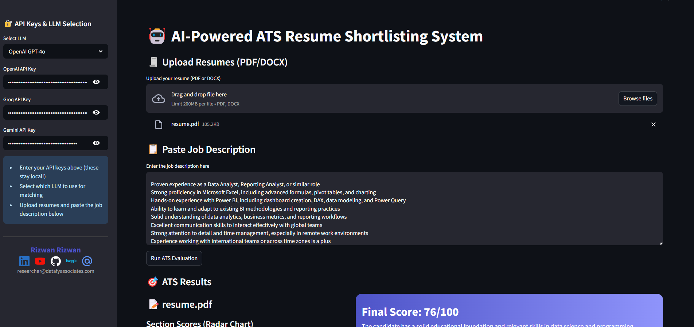

# 🤖 ATS Score Checker

[](https://streamlit.io/) [](https://openai.com/) [](LICENSE)

A modern, AI-powered Applicant Tracking System (ATS) resume checker and scoring dashboard. Instantly analyze your resume against any job description using LLMs (GPT-4o), advanced skill extraction, and beautiful interactive charts.

---

## 🚀 Features
- *LLM-powered scoring:* Uses GPT-4o to analyze and score Education, Skills, and Experience.
- *Advanced skill matching:* Extracts both required (JD) and resume-listed skills, highlighting matched and missing ones.
- *Interactive visualizations:* Modern Plotly radar, bar, and pie charts for section scores and skill coverage.
- *Intelligent job requirements extraction:* Gathers requirements from bullet points, section headers, and key verbs.
- *Beautiful UI:* Clean, dark-themed dashboard with clear sectioning and branding.
- *Personal branding:* Sidebar includes links and contact info for [Rizwan Rizwan](https://www.linkedin.com/in/rizwan-rizwan-1351a650/).

---

## 📸 UI Preview
 

---

## 🛠 Quickstart

1. *Clone the repo:*
   bash
   git clone https://github.com/Rizwankaka/ATS-score-checker.git
   cd ATS-score-checker
   
2. *Install dependencies:*
   bash
   pip install -r requirements.txt
   # or, if using pyproject.toml
   pip install .
   
3. *Run the app:*
   bash
   streamlit run app.py
   

---

## 💡 How to Use
1. *Enter your OpenAI, Groq, or Gemini API key(s) in the sidebar.*
2. *Upload a resume (PDF or DOCX).*
3. *Paste the job description.*
4. *Click "Run ATS Evaluation".*
5. *View your ATS scores, matched/missing skills, and actionable feedback with interactive charts.*

---

## 🔑 API Keys
- *OpenAI API key required* for GPT-4o scoring. Get yours at [platform.openai.com](https://platform.openai.com/).
- Keys are stored locally and never shared.

---

## 🤝 Contributing
Pull requests are welcome! For major changes, please open an issue first to discuss what you would like to change.

---

## 📄 License
[MIT](LICENSE)

---

## 👤 Author & Branding
*Rizwan Rizwan*  
[](https://www.linkedin.com/in/rizwan-rizwan-1351a650/) [](https://www.youtube.com/@RizwanRizwan2R) [](https://github.com/Rizwankaka) [](https://www.kaggle.com/rizwanrizwannazir)  
✉ researcher@datafyassociates.com

---

## 🌐 Repo
[github.com/Rizwankaka/ATS-score-checker](https://github.com/Rizwankaka/ATS-score-checker)

---

> Built with ❤ by Rizwan Rizwan. Powered by OpenAI, Streamlit, and Plotly.
{resume_text}

Respond with:
Score: <number>
Explanation: <detailed reasoning>
```

---

- Modular code: extend modules/ for new LLMs, parsers, or features.
- API keys are stored locally and never shared.
- For issues or feature requests, open an issue or PR.
